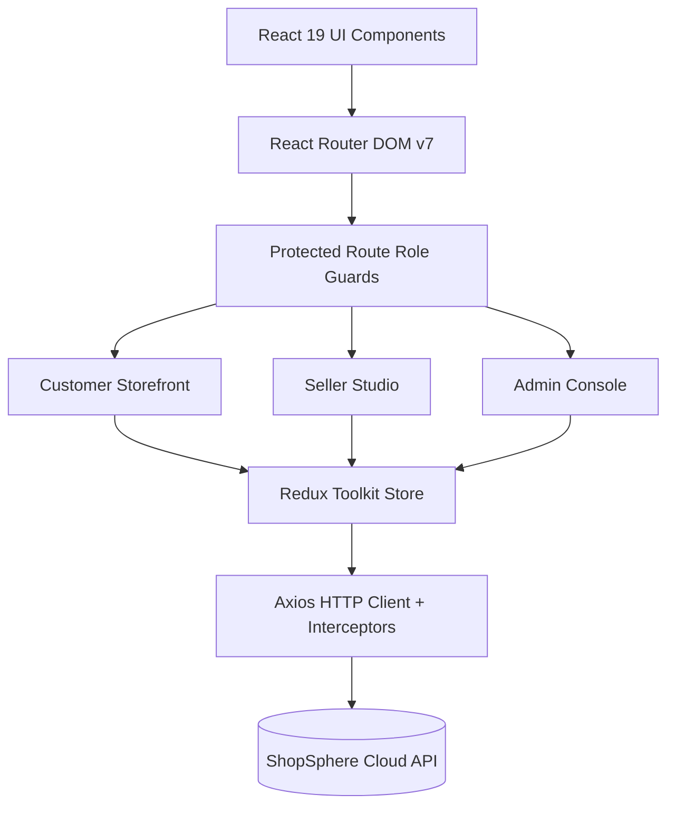
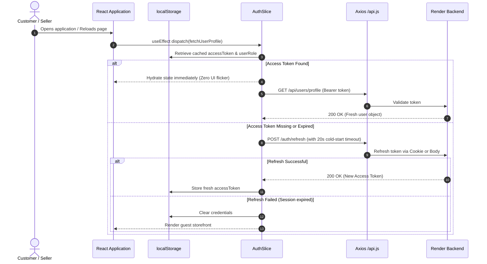

# 🛍️ ShopSphere Frontend — Modern Multi-Vendor E-Commerce Web Client

[](https://react.dev/)
[](https://vitejs.dev/)
[](https://redux-toolkit.js.org/)
[](https://tailwindcss.com/)
[](https://mui.com/)
[](https://web.dev/progressive-web-apps/)
[](https://developers.google.com/search)

ShopSphere is a premier, high-performance **Multi-Vendor E-Commerce Web Client** built with **React 19**, **Vite 8**, and **Redux Toolkit**. Designed for scalability, speed, and modern user experiences, it features dedicated, responsive interfaces for **Customers**, **Independent Sellers**, and **Platform Administrators**.

---

## 🌐 Connected Production Backend

- **Backend API Host**: `https://ecommerce-multivendor-ywdy.onrender.com`
- **Architecture**: Decoupled Client-Server REST API over HTTPS with JWT bearer authentication and cookie fallback.

---

## 📑 Table of Contents

- [Architectural Overview](#-architectural-overview)
- [Portals & Core Capabilities](#-portals--core-capabilities)
  - [1. Customer Storefront](#1-customer-storefront)
  - [2. Seller Management Studio](#2-seller-management-studio)
  - [3. Super Administrator Console](#3-super-administrator-console)
- [Authentication & Resilience](#-authentication--resilience)
- [Production SEO, Branding & PWA Suite](#-production-seo-branding--pwa-suite)
- [Project Directory Structure](#-project-directory-structure)
- [Tech Stack & Dependencies](#-tech-stack--dependencies)
- [Environment Configuration](#-environment-configuration)
- [Local Development & Setup](#-local-development--setup)
- [Build & Deployment Pipeline](#-build--deployment-pipeline)
- [Author & License](#-author--license)

---

## 🏛️ Architectural Overview

ShopSphere Frontend is engineered as a modern Single Page Application (SPA) prioritizing performance, clean state separation, and responsive UX:



### Architectural Highlights
- **Predictable Global State**: Centralized Redux Toolkit store with domain-partitioned slices (`customer`, `seller`, `admin`, `auth`).
- **Cold-Start Resilience**: Built-in 20-second timeout guard on token refresh requests, ensuring smooth recovery when backend cloud containers wake up.
- **Adaptive UI System**: Hybrid styling leveraging **Tailwind CSS v4** for responsive utility layouts and **Material UI v9** for complex interactive controls, tables, and date pickers.
- **Strict Accessibility (a11y)**: ARIA labels, semantic landmark markup, responsive zooming support (`maximum-scale=5.0`), and graceful `<noscript>` fallback.

---

## 🚀 Portals & Core Capabilities

### 1. Customer Storefront

| Feature Area | Functionality |
|---|---|
| **Header & Discovery** | Global persistent search bar with auto-suggestions, category mega menu, cart counter badge, wishlist shortcut, and customer profile drawer. |
| **Dynamic Homepage** | Hero banner slider (powered by Swiper), flash deals carousel with timer countdowns, Shop by Category discovery grid, and curated Electric/Fashion sections. |
| **Product Catalog** | Dynamic multi-attribute filtering (category hierarchy, price ranges, brand, customer ratings, discount percentage, stock status), sorting dropdown, and pagination. |
| **Product Showcase** | High-resolution image gallery, stock availability badge, size/color variant selection, seller trust badge, and verified customer review breakdown. |
| **Cart & Checkout** | Real-time quantity adjustment, promotional coupon validation, multi-address selector with modal creation, and seamless Razorpay/Stripe checkout modal. |
| **Customer Dashboard** | Order history with visual delivery progress trackers, cancellation flow, saved shipping addresses, and personal profile management. |

### 2. Seller Management Studio

- **Seller Onboarding**: Multi-stage application with GSTIN/PAN validation, bank account registration, and business profile details.
- **Analytics & KPIs**: Interactive sales trends, revenue charts (powered by Recharts), total orders, average order value, and refund analytics.
- **Product Catalog Management**: Multi-image uploader, rich product detail inputs, category hierarchy mapping, pricing, and live inventory toggle.
- **Order Fulfillment Center**: Filterable order management table with status updating workflow (`CONFIRMED` $\to$ `SHIPPED` $\to$ `DELIVERED`).
- **Financial Settlements**: Transparent transaction logs and net payout summaries.

### 3. Super Administrator Console

- **Platform Analytics**: Global GMV metrics, active user registrations, active seller count, and daily order throughput.
- **Seller Moderation**: Centralized seller review pipeline with one-click status transitions (`APPROVE`, `SUSPEND`, `BAN`, `REJECT`).
- **Promotions & Coupons**: Coupon generator supporting percentage discounts, maximum rebate caps, validity expiration dates, and minimum order criteria.
- **Homepage Engine**: Interactive homepage category manager allowing administrators to add, modify, reorder, or feature category tiles live on the storefront.

---

## 🔐 Authentication & Resilience



---

## 🎨 Production SEO, Branding & PWA Suite

ShopSphere includes a complete, enterprise-grade SEO and brand asset implementation in `public/` and `index.html`:

```
ecommerce_react/public/
├── favicon.svg                 # Vector SVG brand icon (Emerald orb + S monogram + gold star)
├── favicon.ico                 # Multi-res legacy ICO container (16x16, 32x32, 48x48)
├── favicon-16x16.png           # High-DPI browser tab icon (16x16)
├── favicon-32x32.png           # High-DPI browser tab icon (32x32)
├── favicon-48x48.png           # Desktop browser shortcut icon (48x48)
├── apple-touch-icon.png        # iOS Home Screen bookmark icon (180x180)
├── android-chrome-192x192.png  # PWA app launcher icon (192x192 maskable)
├── android-chrome-512x512.png  # PWA splash screen icon (512x512 maskable)
├── og-image.png                # Social share banner (1200x630, Open Graph & Twitter)
├── site.webmanifest            # Progressive Web App manifest
├── robots.txt                  # Search crawler indexing rules
└── sitemap.xml                 # Search engine sitemap index
```

### HTML Head Optimizations
- **Search Metadata**: Targeted title, description, keywords, and Googlebot/Bingbot crawler instructions.
- **Adaptive Theming**: Dual `theme-color` meta tags matching system light (`#00927c`) and dark (`#0b0f19`) themes.
- **Social Sharing**: Open Graph protocol and Twitter Card tags configured with high-res 1200x630 preview cards.
- **Structured Data (JSON-LD)**: Schema.org `Organization` and `WebSite` metadata with interactive `SearchAction`.
- **Preconnect Directives**: Pre-warmed TLS connections for Google Fonts, Unsplash CDN, backend API, and Razorpay payment gateways.

---

## 📂 Project Directory Structure

```
ecommerce_react/
├── public/                      # Static assets, favicons, robots.txt, manifest
├── src/
│   ├── admin/                   # Admin portal pages and management components
│   │   ├── components/          # AdminNavbar, AdminDrawerList
│   │   └── pages/               # Dashboard, Sellers, Coupon, HomePage, Users
│   ├── customer/                # Customer storefront experience
│   │   ├── components/          # Navbar, Footer, CategoryCard, Slider
│   │   ├── pages/               # Home, Product, ProductDetails, Cart, Checkout, Account, Review
│   │   └── Wishlist/            # Wishlist overview and card actions
│   ├── seller/                  # Seller portal and operations
│   │   ├── components/          # SellerNavbar, SellerDrawerList
│   │   └── pages/               # Dashboard, Products, Orders, Payment, Account, Verification
│   ├── State/                   # Redux Toolkit global store configuration
│   │   ├── admin/               # adminSlice, adminFetchSlice
│   │   ├── customer/            # CartSlice, OrderSlice, ProductSlice, WishlistSlice, CouponSlice
│   │   ├── seller/              # sellerSlice, sellerProductSlice, sellerOrderSlice, transactionSlice
│   │   ├── AuthSlice.js         # Authentication, token lifecycle, profile hydration
│   │   └── Store.js             # Root Redux store configuration
│   ├── common/                  # Shared UI components (EmptyState, ErrorState, StatusBadge, Skeletons)
│   ├── config/                  # Axios HTTP client instance, baseURL, Razorpay loader
│   ├── data/                    # Static category configurations and navigation datasets
│   ├── Routes/                  # ProtectedRoute and modular route groupings
│   ├── Theme/                   # Custom Material UI theme palette
│   ├── App.jsx                  # Main application router tree
│   ├── main.jsx                 # Entry point with Redux Provider & Router
│   └── index.css                # Tailwind CSS imports and global styles
├── index.html                   # Production-optimized root HTML document
├── vite.config.js               # Vite 8 bundling, plugin, and chunk split settings
└── package.json                 # Project dependencies and script scripts
```

---

## 🛠️ Tech Stack & Dependencies

| Category | Technology | Version | Purpose |
|---|---|---|---|
| **Core Framework** | React | `^19.2.6` | Modern UI rendering engine with Concurrent Mode |
| **Build Tool** | Vite | `^8.0.12` | Lightning-fast HMR and optimized production bundling |
| **State Management** | Redux Toolkit | `^2.12.0` | Predictable centralized state with async thunks |
| **Routing** | React Router DOM | `^7.18.0` | Client-side routing and route-level protection |
| **UI Components** | Material UI (MUI) | `^9.1.1` | Complex controls, dialogs, drawers, and date pickers |
| **Utility Styling** | Tailwind CSS | `^4.3.1` | Atomic responsive utility styling |
| **Icons** | Lucide React / MUI Icons | `^1.21.0` | Crisp SVG iconography |
| **HTTP Client** | Axios | `^1.18.1` | Interceptors for auth tokens, refresh, and error handling |
| **Form Handling** | Formik & Yup | `^2.4.9` | Schema validation and robust form state |
| **Data Visualization** | Recharts | `^3.8.1` | Interactive charts for seller and admin dashboards |
| **Carousels** | Swiper | `^12.2.0` | High-performance touch sliders and banners |

---

## ⚙️ Environment Configuration

Create a `.env` file in the root of `ecommerce_react`:

```properties
# Backend API Base URL
VITE_API_BASE_URL=https://ecommerce-multivendor-ywdy.onrender.com

# Razorpay Key ID (Client-side)
VITE_RAZORPAY_KEY_ID=rzp_test_your_key_id
```

For local backend development, point to your local Spring Boot instance:
```properties
VITE_API_BASE_URL=http://localhost:5454
```

---

## 💻 Local Development & Setup

### Prerequisites
- **Node.js**: v18.18.0+ or v20+ (LTS recommended)
- **npm**: v9+ or **yarn** / **pnpm**

### Installation & Execution

1. **Clone the repository**:
   ```bash
   git clone https://github.com/yourusername/ecommerce_react.git
   cd ecommerce_react
   ```

2. **Install dependencies**:
   ```bash
   npm install
   ```

3. **Start Development Server**:
   ```bash
   npm run dev
   ```
   The local application will launch at `http://localhost:5173`.

4. **Lint Code**:
   ```bash
   npm run lint
   ```

---

## 📦 Build & Deployment Pipeline

### Production Build
Execute the production build script:
```bash
npm run build
```

Vite will bundle and minify all assets into the `dist/` directory:
```text
dist/index.html                             7.61 kB │ gzip:   2.42 kB
dist/assets/vendor-react-BgJ4idxy.css       8.62 kB │ gzip:   1.58 kB
dist/assets/index-CzUa5Mg7.css            193.07 kB │ gzip:  23.83 kB
dist/assets/vendor-mui-Cg71lX4M.js        584.42 kB │ gzip: 179.00 kB
dist/assets/index-Z6LX3fQx.js             710.55 kB │ gzip: 147.83 kB
dist/assets/vendor-react-Bxhf484M.js      803.17 kB │ gzip: 247.54 kB
✓ built in 914ms
```

### Hosting Deployment (Vercel, Netlify, Cloudflare, Nginx)
When deploying to static hosts, ensure all routes fallback to `index.html` for client-side routing.

#### Vercel (`vercel.json`)
```json
{
  "rewrites": [
    { "source": "/(.*)", "destination": "/index.html" }
  ]
}
```

#### Netlify (`_redirects` in `public/`)
```text
/*    /index.html   200
```

#### Nginx Configuration
```nginx
location / {
    root   /usr/share/nginx/html;
    index  index.html;
    try_files $uri $uri/ /index.html;
}
```

---

## 👨‍💻 Author & Acknowledgments

**Yash Sunil Lodam**  
*Full Stack Software Engineer & Frontend Architect*  
- **GitHub**: [@yashlodam](https://github.com/yashlodam)

---

## 📄 License

This project is licensed under the **MIT License**.
